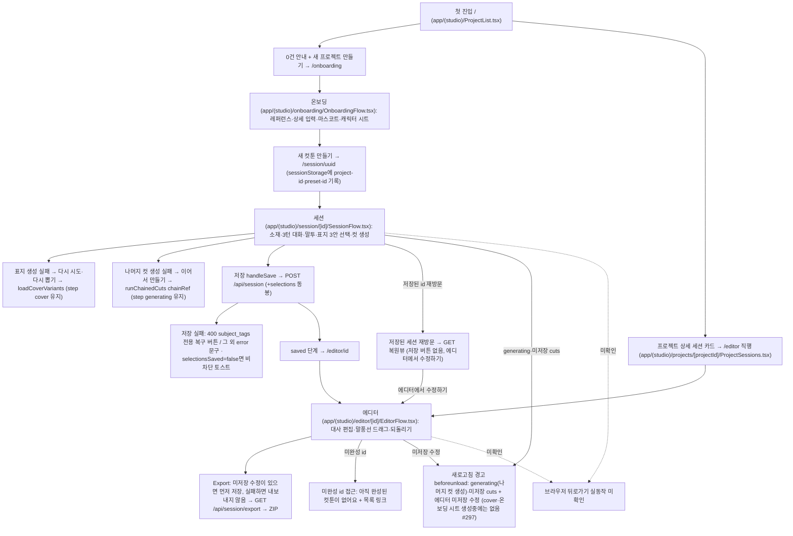
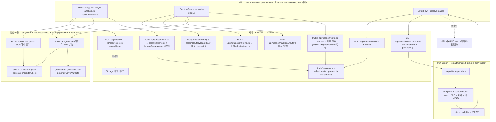

# 사용자·프로세스 흐름

- 기준 커밋: `73395e2` (main, 2026-10-08)
- 작성일: 2026-10-08
- 원칙: 코드(기준 커밋)를 직접 따라 그린다 — 문서 문구를 옮기지 않는다. 확인 못한 연결은 점선 + "미확인"으로 표시한다.
- 함수 단위 상세 흐름은 `docs/pipeline.md` 1~4절, 흐름 점검 근거는 `.roster/inv-flow-lozu.md`를 본다.
- 실선 = 코드에서 확인한 연결, 점선 = 미확인·진행중.

## 1. 사용자 흐름 — 첫 진입부터 Export ZIP까지

## 2. 프로세스 흐름 — 소유자별 레인

레인 기준: `docs/operations.md` 폴더 구조와 소유권 표.

