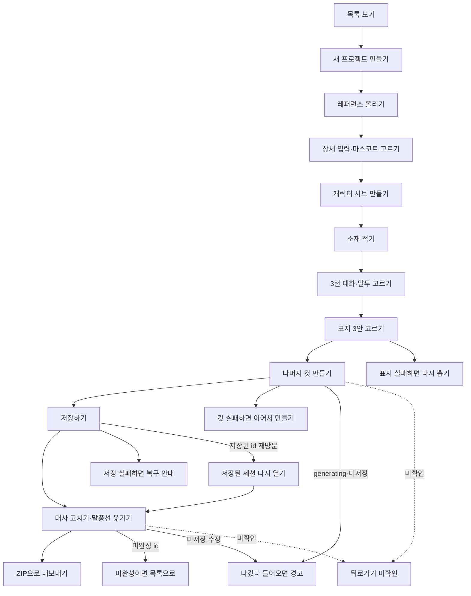
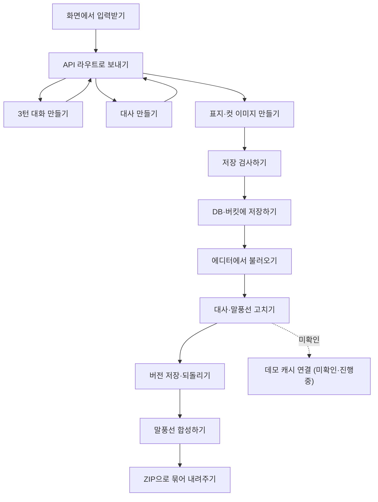
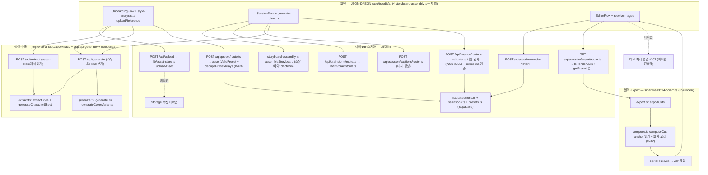

# 사용자·프로세스 흐름

- 기준 커밋: `a06a040` (main, 2026-10-08)
- 작성일: 2026-10-08
- 원칙: 코드(기준 커밋)를 직접 따라 그린다 — 문서 문구를 옮기지 않는다. 확인 못한 연결은 점선 + "미확인"으로 표시한다.
- 함수 단위 상세 흐름은 `docs/pipeline.md` 1~4절, 흐름 점검 근거는 `.roster/inv-flow-lozu.md`를 본다.
- 실선 = 코드에서 확인한 연결, 점선 = 미확인·진행중.

## 1. 사용자 흐름 — 첫 진입부터 Export까지

## 2. 프로세스 흐름 — 화면 입력부터 ZIP까지

## 3. 상세 — 소유자별 레인 · 파일 경로

소유자별 레인 · 파일 경로 (펼쳐 보기)

| 단계 | 파일 | 소유 |
| --- | --- | --- |
| 화면 | `app/(studio)/` (단 `session/[id]/storyboard-assembly.ts`는 제외) | JEON-DAEJIN |
| 스토리보드 조립 | `app/(studio)/session/[id]/storyboard-assembly.ts` (소유 예외) | chictimin |
| 세션·프리셋·업로드·브레인스토밍 API | `app/api/session/` · `app/api/preset/` · `app/api/upload/` · `app/api/brainstorm/` | chictimin |
| 스키마·LLM·DB | `spec/` · `lib/llm/` · `lib/db/` · `lib/asset-store.ts` · `lib/session/` | chictimin |
| 생성·추출 API | `app/api/generate/` · `app/api/extract/` | joniverse-ai |
| 이미지 생성·추출 | `lib/openai/` | joniverse-ai |
| 렌더·Export | `lib/render/` | smartman3514-commits |

