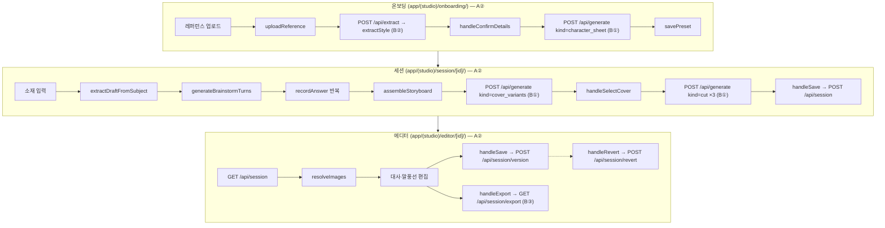

# 컷툰 코파일럿 파이프라인 — 온보딩 → 세션 → 에디터

머지된 코드만 기준으로 한다. 열려 있는 PR·이슈의 계획은 넣지 않는다. 함수명이 주 식별자이고 file:line은 보조다 — 라인은 커밋마다 밀린다.

**범위**: A 소유 경로(`app/(studio)/`, `lib/llm/`, `lib/db/`, `spec/`, A 소유 `app/api/*`)만 채웠다. B 소유(`lib/openai/`, `lib/render/`, `app/api/generate/`)는 내부 구현을 적지 않고, A가 그 경계를 어떻게 호출하는지(계약)까지만 적었다 — "B가 그 안에서 무엇을 하는지"는 B 소유자 작성 대기다. 해당 섹션에 표시했다.

## 1. 전체 흐름

## 2. 온보딩 (A②)

| 순서 | 함수 | 위치 | 호출 대상 |
|---|---|---|---|
| 1 | `handleFilesSelected` → `runAnalysis` | `OnboardingFlow.tsx:64,51` | `uploadReference`, `analyzeStyle` |
| 2 | `uploadReference` | `style-analysis.ts:8` | `POST /api/upload` → `uploadAsset`(`lib/asset-store.ts`) |
| 3 | `analyzeStyle` | `style-analysis.ts:28` | `POST /api/extract { assetUris }` — B② 경계, 3번 섹션 참고 |
| 4 | `handleConfirmDetails` | `OnboardingFlow.tsx:93` | `POST /api/generate { kind:'character_sheet', preset }` — B① 경계 |
| 5 | 프리셋 저장 | `OnboardingFlow.tsx` | `POST /api/preset` → `savePreset`(`app/api/preset/route.ts:24`, A③) |

## 3. 세션 (A②)

| 순서 | 함수 | 위치 | 호출 대상 |
|---|---|---|---|
| 1 | `startBrainstorm` → `loadTurns` | `SessionFlow.tsx:257,217` | `POST /api/brainstorm` |
| 2 | (route, A①) | `app/api/brainstorm/route.ts` | `body.draft` 없으면 `extractDraftFromSubject`(`brainstorm.ts:259`) 먼저 호출 |
| 3 | `generateBrainstormTurns` | `brainstorm.ts:78` | 내부 `isSlotFilled`(:26)·`areAllSlotsComplete`(:57)로 draft 기준 남은 턴만 생성. gpt-4o 텍스트 호출(A① 소유 — 세부는 5-1번 참고) |
| 4 | 응답의 `resolved` | `SessionFlow.tsx` `loadTurns` | `setAnswers`로 선반영 (#154) |
| 5 | `recordAnswer` 반복 | `SessionFlow.tsx:190` | 3턴(또는 축소된 턴) 완료 시 `assembling`으로 전이 |
| 6 | assembling effect | `SessionFlow.tsx:262` | `assembleStoryboard`(`storyboard-assembly.ts:86`) |
| 7 | `assembleStoryboard` 내부 | `storyboard-assembly.ts` | `pickShirtColor`(`session-cast.ts:63`, #148), `getBeatsForFlow`/`getFlowOptions`(`narrative-flow.ts`, #153) |
| 8 | `loadCoverVariants` | `SessionFlow.tsx:291` | `POST /api/generate { kind:'cover_variants', storyboard, preset, referenceAssets }` — B① 경계 |
| 9 | `handleSelectCover` | `SessionFlow.tsx:306` | `generateChainedCuts`(`generate-client.ts`, A②) → `POST /api/generate { kind:'cut', ... }` × 3 — B① 경계 |
| 10 | `handleSave` | `SessionFlow.tsx:366` | `POST /api/session` (A③, `lib/db/sessions.ts`에 저장) |

## 4. 에디터 (A②)

| 순서 | 함수 | 위치 | 호출 대상 |
|---|---|---|---|
| 1 | mount effect | `EditorFlow.tsx:97` | `GET /api/session` → `resolveImages`(:46) |
| 2 | 대사·말풍선 편집 | `EditorFlow.tsx` | 로컬 state만, 호출 없음 |
| 3 | `handleSave` | `EditorFlow.tsx:193` | `POST /api/session/version` (A③) |
| 4 | `handleRevert` | `EditorFlow.tsx:228` | `POST /api/session/revert` (A③) |
| 5 | `handleExport` | `EditorFlow.tsx:260` | `GET /api/session/export` — B③ 경계, 5-2번 참고 |

## 5. B 소유 파트 (작성 대기)

아래 두 절은 특정 A 단계(온보딩·세션·에디터)의 하위가 아니다 — 이미지 생성(5-1)은 온보딩·세션 양쪽에서 쓰이고, 합성·Export(5-2)는 에디터에서 쓰인다. B 소유자가 채울 자리다.

### 5-1. 텍스트/이미지 생성 (B①)

A가 넘기는 것과 받는 것(계약)만 적었다. 내부에서 어떤 모델을 쓰는지, 프롬프트를 어떻게 조립하는지는 B① 작성 대기.

- **`extractStyle(refs: Buffer[])`** — B②. `POST /api/extract`가 A①/A②가 올린 `assetUris`를 `readAsset`로 buffer화해 넘긴다. 반환 `StyleExtractionResult`(`extract.ts`). 내부 동작은 5-1b절.
- **`ImageProvider`**(`lib/openai/provider.ts`, B①) — A가 실제로 부르는 계약:
  - `generateCharacterSheet(preset: unknown): Promise<GeneratedImageResult>`
  - `generateCoverVariants(input: { storyboard, preset, referenceAssets, count: 3 }): Promise<GeneratedImageResult[]>` — `count`가 리터럴 타입 `3`으로 고정돼 있어 호출부가 다른 값을 넘길 수 없다
  - `generateCut(input: { storyboard, preset, referenceAssets, continueFrom?: string }): Promise<GeneratedImageResult>` — `continueFrom`은 프로바이더 중립 체이닝 토큰
  - 공통 반환 `GeneratedImageResult`: `{ asset, width, height, reserved_zone?, continuationToken?, stub?, prompt? }`
- **`POST /api/generate`**(`app/api/generate/route.ts`, B①) — body `{ kind: 'character_sheet'|'cover_variants'|'cut', ... }`로 위 세 함수에 매핑. `kind`별 body 필드는 각 함수 입력과 동일.

작성 대기 항목(B①): 실제 사용 모델·API, 세션당 실호출 횟수, 프롬프트 조립 로직, 체이닝 내부 처리.

### 5-1b. 스타일 분석 · 캐릭터 시트 생성 (B②)

`lib/openai/extract.ts` 소유. 이 파일이 내보내는 건 아래 두 함수뿐이다.

- **`extractStyle(refs: Buffer[])`**(`extract.ts:83`) — 모델 `gpt-4o`, `client.chat.completions.create`(`extract.ts:91`) 1회, `response_format: json_object`, `max_tokens: 300`. `refs` N장을 **한 번의 호출**에 `image_url` content part N개로 담아 보낸다(`extract.ts:84-89`) — 이미지 장수와 API 호출 수는 무관하다. 반환 직후 비공개 헬퍼 `normalizeStyle()`(`extract.ts:55`, export 없음)이 필드 존재·enum 값을 검증·보정한다(#140) — 모듈 밖에서는 재사용할 수 없다.
- **`generateCharacterSheet(preset: PresetInput)`**(`extract.ts:207`) — 모델 `gpt-image-1`, `client.images.generate`(`extract.ts:212`) 1회, `n: 1`, `size: "1024x1024"`(`OUTPUT_SIZE`, `generate.ts:39`). 내부에서 `buildCharacterPrompt(preset)`(`extract.ts:134`)를 1회 호출해 프롬프트를 조립한 뒤 그 문자열로 이미지 1장을 만든다.

**호출 순서 (온보딩 1회, 재시도 없는 골든 패스)**

| 순서 | 함수 | 위치 | 호출 대상 |
|---|---|---|---|
| 1 | `handleFilesSelected` → `runAnalysis` | `OnboardingFlow.tsx:62,49` | — |
| 2 | `analyzeStyle` → `uploadReference` ×N | `style-analysis.ts:33` | `POST /api/upload` ×N |
| 3 | `analyzeStyle` → fetch | `style-analysis.ts:35-39` | `POST /api/extract` → **`extractStyle`** ×1 |
| 4 | `handleConfirmStyle` | `OnboardingFlow.tsx:87` | (화면 전환, 호출 없음) |
| 5 | `handleConfirmDetails` → fetch | `OnboardingFlow.tsx:104-119` | `POST /api/generate {kind:"character_sheet"}` → **`generateCharacterSheet`** ×1 |

**세션당 호출 횟수 (판정 예산 관련)**

- 이미지 생성(유료) 호출: `generateCharacterSheet`는 프로젝트 생성 시 **정확히 1회**뿐이다 — 재시도 버튼이 없다(#19 결정: 세션마다 다시 만들지 않음). 그 프로젝트로 세션을 몇 개 만들거나 몇 번 재방문해도 추가 호출은 없다.
- 텍스트 호출: `extractStyle`은 `ResultStep`의 "다시 뽑기"(`OnboardingFlow.tsx:387-393`)를 누를 때마다 추가로 1회씩 늘어난다 — 상한이 없어 사용자가 원하는 만큼 반복 가능하다. 같은 클릭이 같은 파일을 `/api/upload`에 재업로드하므로, 재시도 1회당 업로드 N회 + 추출 1회가 함께 늘어난다.
- 참고: `generateCoverVariants`(B①)에도 별도 "다시 뽑기"가 있다(`SessionFlow.tsx:436-461`). 이건 `extract.ts` 소관이 아니라 혼동 방지로만 적는다.

**`spec/vocabulary.json` 소비 방식**

`extract.ts`는 `vocabulary.json`을 직접 import하지 않는다. `./generate`에서 `ratioClause`만 가져와 쓴다(`extract.ts:4`). `ratioClause(value)`(`generate.ts:164-167`)는 내부에서 `promptHint('character_ratio', value)`(`generate.ts:141`)로 `vocabulary.json`의 `prompt_hints.character_ratio` 항목을 찾고, 없으면 `` `${value} body proportions` `` 문자열로 폴백한다. `buildCharacterPrompt`(`extract.ts:154`)가 이 결과를 시트 프롬프트에 그대로 넣는다 — `generate.ts`의 `buildCutPrompt`도 같은 헬퍼를 쓰기 때문에 시트와 컷이 항상 같은 비율 지시를 받는다(#126·#129 회귀 방지, PR #130).

### 5-2. 텍스트 레이어 합성·Export (B③)

- **`GET /api/session/export`**(`app/api/session/export/route.ts`, A③ 소유 라우트) — 세션의 `storyboard.cuts`를 받아 최종 합성 이미지 ZIP을 반환한다. 내부에서 `lib/render/`(B③)의 합성·zip 로직을 호출한다.

작성 대기 항목(B③): `lib/render/`의 실제 함수·호출 순서, 캡션/말풍선 합성 방식, ZIP 구성 방식.

## 6. 데이터 파일 vs 코드 (A 소유분)

**`spec/data/`로 이미 분리된 것**

| 파일 | 내용 | 로더 |
|---|---|---|
| `cta_presets.json` | CTA 문구 8종 | `lib/llm/cta-presets.ts` |
| `narrative-flow.json` | 서사 흐름 템플릿 3종(#153) | `lib/llm/narrative-flow.ts` |
| `style-vocabulary.json` | 스타일 키워드 매핑 | `lib/llm/preset-guard.ts`(`checkUnmappedWordsPolicy` 관련) |

**`spec/vocabulary.json`**(위 `data/`와 다른 위치, A① 소유) — enum별 프롬프트 힌트. B①(`lib/openai/generate.ts`)이 프롬프트 조립에 쓰지만, 그 소비 방식은 B① 작성 대기.

**아직 코드에 남은 상수** (`storyboard-assembly.ts`, A②, #152 대상)

| 상수 | 위치 | 내용 |
|---|---|---|
| `BEAT_EXPRESSION_POSE` | :31 | narrative_beat별 표정·포즈 매핑 |
| `BEAT_CAPTION` | :44 | narrative_beat별 캡션 문구 템플릿 |
| `CUT_SHOT_PLAN` | :57 | 컷별 shot_type·camera_angle 고정 시퀀스 |
| `CAPTION_POSITIONS` | :64 | 컷별 캡션 위치 고정 시퀀스 |

## 7. 소유 경계 (`README.md` 폴더 소유권 표 기준)

| 경로 | 담당 |
|---|---|
| `app/(studio)/` | A② |
| `app/api/preset/`, `app/api/session/`, `lib/db/` | A③ |
| `lib/llm/`, `app/api/brainstorm/`, `spec/` | A① |
| `app/api/generate/`, `lib/openai/generate.ts`, `lib/openai/provider.ts` | B① |
| `lib/openai/extract.ts` | B② |
| `lib/render/` | B③ |

## 8. 구현은 있으나 호출자가 없는 함수 (전부 A① 소유)

| 함수 | 위치 | 실제 호출자 | 관련 이슈 |
|---|---|---|---|
| `buildSessionCast` | `lib/llm/session-cast.ts:71` | 없음 | #150 |
| `mergeStyleValues` | `lib/llm/style-merge.ts:77` | 없음 | #151 |
| `checkUnmappedWordsPolicy` | `lib/llm/preset-guard.ts:333` | `preset-guard.demo.ts`(데모 스크립트)뿐 — 실제 파이프라인 경로 없음 | #125 |

`lib/llm/`의 나머지 export는 위 세 개를 제외하고 전부 실제 호출자가 있다(`DetailsStep.tsx`, `EditorFlow.tsx`, `SessionFlow.tsx`, `app/api/session/*`, `app/api/brainstorm/route.ts` 등에서 확인).
