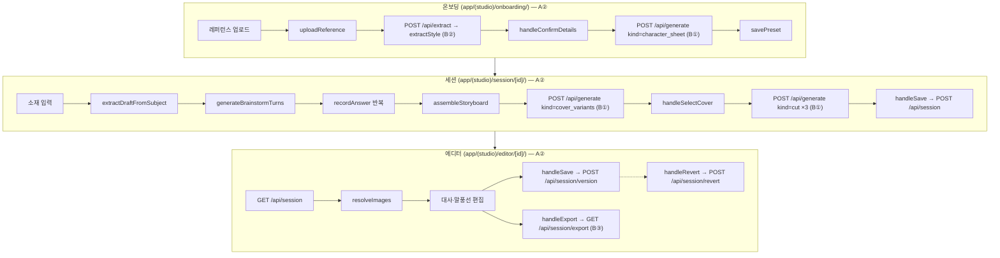

# 컷툰 코파일럿 파이프라인 — 온보딩 → 세션 → 에디터

머지된 코드만 기준으로 한다. 열려 있는 PR·이슈의 계획은 넣지 않는다. 함수명이 주 식별자이고 file:line은 보조다 — 라인은 커밋마다 밀린다.

**범위**: A 소유 경로(`app/(studio)/`, `lib/llm/`, `lib/db/`, `spec/`, A 소유 `app/api/*`)만 채웠다. B 소유(`lib/openai/`, `lib/render/`, `app/api/generate/`)는 내부 구현을 적지 않고, A가 그 경계를 어떻게 호출하는지(계약)까지만 적었다 — "B가 그 안에서 무엇을 하는지"는 B 소유자 작성 대기다. 해당 섹션에 표시했다.

## 1. 전체 흐름



## 2. 온보딩 (A②)

| 순서 | 함수 | 위치 | 호출 대상 |
|---|---|---|---|
| 1 | `handleFilesSelected` → `runAnalysis` | `OnboardingFlow.tsx:64,51` | `uploadReference`, `analyzeStyle` |
| 2 | `uploadReference` | `style-analysis.ts:8` | `POST /api/upload` → `uploadAsset`(`lib/asset-store.ts`) |
| 3 | `analyzeStyle` | `style-analysis.ts:28` | `POST /api/extract { assetUris }` — B② 경계, 3번 섹션 참고 |
| 4 | `handleConfirmDetails` | `OnboardingFlow.tsx:93` | `POST /api/generate { kind:'character_sheet', preset }` — B① 경계 |
| 5 | 프리셋 저장 | `OnboardingFlow.tsx` | `POST /api/preset` → `savePreset`(`app/api/preset/route.ts:24`, A③) |

## 3. 세션 (A②)

| 순서 | 함수 | 위치 | 호출 대상 |
|---|---|---|---|
| 1 | `startBrainstorm` → `loadTurns` | `SessionFlow.tsx:257,217` | `POST /api/brainstorm` |
| 2 | (route, A①) | `app/api/brainstorm/route.ts` | `body.draft` 없으면 `extractDraftFromSubject`(`brainstorm.ts:259`) 먼저 호출 |
| 3 | `generateBrainstormTurns` | `brainstorm.ts:78` | 내부 `isSlotFilled`(:26)·`areAllSlotsComplete`(:57)로 draft 기준 남은 턴만 생성. gpt-4o 텍스트 호출(A① 소유 — 세부는 5-1번 참고) |
| 4 | 응답의 `resolved` | `SessionFlow.tsx` `loadTurns` | `setAnswers`로 선반영 (#154) |
| 5 | `recordAnswer` 반복 | `SessionFlow.tsx:190` | 3턴(또는 축소된 턴) 완료 시 `assembling`으로 전이 |
| 6 | assembling effect | `SessionFlow.tsx:262` | `assembleStoryboard`(`storyboard-assembly.ts:86`) |
| 7 | `assembleStoryboard` 내부 | `storyboard-assembly.ts` | `pickShirtColor`(`session-cast.ts:63`, #148), `getBeatsForFlow`/`getFlowOptions`(`narrative-flow.ts`, #153) |
| 8 | `loadCoverVariants` | `SessionFlow.tsx:291` | `POST /api/generate { kind:'cover_variants', storyboard, preset, referenceAssets }` — B① 경계 |
| 9 | `handleSelectCover` | `SessionFlow.tsx:306` | `generateChainedCuts`(`generate-client.ts`, A②) → `POST /api/generate { kind:'cut', ... }` × 3 — B① 경계 |
| 10 | `handleSave` | `SessionFlow.tsx:366` | `POST /api/session` (A③, `lib/db/sessions.ts`에 저장) |

## 4. 에디터 (A②)

| 순서 | 함수 | 위치 | 호출 대상 |
|---|---|---|---|
| 1 | mount effect | `EditorFlow.tsx:97` | `GET /api/session` → `resolveImages`(:46) |
| 2 | 대사·말풍선 편집 | `EditorFlow.tsx` | 로컬 state만, 호출 없음 |
| 3 | `handleSave` | `EditorFlow.tsx:193` | `POST /api/session/version` (A③) |
| 4 | `handleRevert` | `EditorFlow.tsx:228` | `POST /api/session/revert` (A③) |
| 5 | `handleExport` | `EditorFlow.tsx:260` | `GET /api/session/export` — B③ 경계, 5-2번 참고 |

## 5. B 소유 파트 (작성 대기)

아래 두 절은 특정 A 단계(온보딩·세션·에디터)의 하위가 아니다 — 이미지 생성(5-1)은 온보딩·세션 양쪽에서 쓰이고, 합성·Export(5-2)는 에디터에서 쓰인다. B 소유자가 채울 자리다.

### 5-1. 텍스트/이미지 생성 (B①)

`app/api/generate/route.ts` · `lib/openai/generate.ts` · `lib/openai/provider.ts` 소유. `generate.ts` 가 내보내는 것은 아래 다섯 개다.

| export | 위치 | 용도 |
|---|---|---|
| `generateCut` | `generate.ts:452` | 컷 1장 생성 |
| `generateCoverVariants` | `generate.ts:513` | 표지 3안 생성 |
| `OUTPUT_SIZE` | `generate.ts:39` | `{width:1024,height:1024}`. `extract.ts` 가 시트 크기로 가져간다 |
| `promptHint` | `generate.ts:141` | `prompt_hints` 조회. 없으면 `undefined` — 힌트 유무를 구분해야 하는 자리를 위해 `hint()`(`:146`)와 나눠 뒀다 |
| `ratioClause` | `generate.ts:164` | `character_ratio` 절. **폴백 규칙까지** 한 곳에 둔다 — 아래 참고 |

`ratioClause(value)` 가 규칙 자체를 담는다. `extract.ts`(B②)도 이것을 가져다 써서 시트와 컷이 항상 같은 비율 지시를 받는다.

```ts
const v = value ?? '2.5head'
return promptHint('character_ratio', v) ?? `${v} body proportions`
```

**순서가 중요하다: 기본값을 먼저 적용한 뒤 힌트를 찾는다.** 반대로 하면 `character_ratio` 가 비었을 때 힌트를 건너뛰고 토큰으로 떨어진다. 그리고 라벨(`body proportions`)은 **힌트가 없을 때만** 붙인다 — 힌트 서술문은 그 자체로 완결된 구라서 뒤에 라벨을 또 붙이면 문장이 깨진다.

`promptHint` 만 공유하고 이 세 줄을 각 파일에 복사해 뒀을 때 규칙이 갈라지는 사고가 두 번 났다(#126 에서 생기고 #129 에서 발견, PR #128·#130 으로 절 자체를 공유해 닫음). 스모크의 정적 검사가 `promptHint('character_ratio', …)` 가 **몇 곳에 나오는지** 세는 이유다.

`generateCharacterSheet` 는 이 파일이 아니라 `extract.ts`(B②) 소유다 — `extractStyle` 과 결합도가 높아 #19 로 그렇게 정했다. `route.ts` 가 `kind:'character_sheet'` 를 그쪽으로 넘긴다.

**모델·API — B② 와 다르다**

`client.responses.create`(`generate.ts:385`), 모델 `gpt-5`(`RESPONSES_MODEL`, `:19`), 이미지는 내장 도구 `tools: [{ type:'image_generation', size:'1024x1024' }]`(`:394`)로 만든다. 응답에서 `image_generation_call` 출력을 찾아 base64 를 꺼낸다(`:401`).

B② 의 `generateCharacterSheet` 는 `client.images.generate`(Images API)를 쓴다. **같은 이미지 모델을 부르는 두 경로가 공존한다** — 체이닝(`previous_response_id`)이 Responses API 에만 있어서 컷 쪽은 이 경로여야 한다. SDK(^7.5.0) 의 Responses 타입이 도구 옵션을 못 따라와 `as any` 로 우회하고 있다(`:383` 주석).

**세션당 이미지 호출 횟수 (판정 예산)**

| 단계 | 호출 | 비고 |
|---|---|---|
| 표지 3안 | **3회** (병렬) | `Promise.allSettled` — 한 안이 실패해도 성공분을 버리지 않는다 (#104) |
| 나머지 3컷 | **3회** (순차) | 체이닝이라 병렬 불가 |
| **골든 패스 합계** | **6회** | 캐릭터 시트 1회는 온보딩 소관(5-1b) |

표지 3안에는 **부족분 재시도**가 있다(#108·#118). 예산은 `count * 2 = 6` 회이고, 한 배치가 통째로 실패하면 그 자리에서 멈춘다(`gained === 0`) — 남은 실패 원인이 업로드 계열, 즉 환경 문제라 재시도해도 같이 실패하기 때문이다(#67 이 그 상황이었다).

```bash
COVER_VARIANT_RETRY=off   # 재시도를 끈다. 기본값은 on
```

**판정·측정 때는 끄는 것을 권한다.** 재시도가 부족분을 채워버리면 "3안 중 2안" 이라는 수치가 보이지 않는다. 부족분이 생기면 원인이 세 갈래로 찍힌다 — `재시도 꺼짐` / `재시도 한도 소진` / `배치 전멸로 중단`.

**호출 순서 (세션 1회, 재시도 없는 골든 패스)**

A② 소유 파일은 **함수명만 적는다** — 5-1b 절과 같은 이유다.

| 순서 | 함수 | 위치 | 호출 대상 |
|---|---|---|---|
| 1 | `handleSelectCover` → `generateCoverVariants` | `generate-client.ts` | `POST /api/generate {kind:"cover_variants"}` → **`generateCoverVariants`** ×1 (내부 3회) |
| 2 | `handleSelectCover` → `generateChainedCuts` | `generate-client.ts` | `POST /api/generate {kind:"cut"}` ×3 → **`generateCut`** ×3 |

`kind:'cover_variants'` 응답에는 `requested: 3` 이 함께 실린다(`route.ts`, #108). `allSettled` 라 배열이 1~3 개일 수 있어서, 화면이 `result.length < requested` 로 부족분을 판단한다(#117).

**프롬프트 조립 — `buildCutPrompt`(`generate.ts:171`)**

표지 3안과 4컷이 **같은 함수**를 쓴다. 표지는 `cuts[0]`, 컷은 `nextUngeneratedCut`(`:336`)이 고른 컷을 넘긴다.

넣는 순서는 이렇다.

| # | 조각 | 근거 |
|---|---|---|
| 1 | 시트는 **그림체만** 따르고 인물은 아래 서술을 따른다 | 런타임 시트는 `preset.context`(타깃 독자)로 그려진 제3의 인물이라 컷 인물과 대응하지 않는다 (#113) |
| 2 | `Style:` — `line_weight` · `saturation` · `background_density` · `ratioClause` | `character_ratio` 가 문장 끝이다. 힌트 서술문이 길어서 뒤에 절이 붙으면 배경 지시가 묻힌다 (#131) |
| 3 | `Color palette:` · `Style keywords:` | 값이 없으면 문장을 넣지 않는다 — 채움말이 지시로 읽힌다 |
| 4 | 소재 + **설명 장치 금지** | 차트·그래프·화살표·아이콘·라벨·해부 도해 금지, 숫자는 캡션 레이어 몫 (#146). 효과선은 허용 (#133 결정 6) |
| 5 | 타깃 독자 (`Who this comic is made for — not who appears in the panel`) | 타깃과 등장 인물이 다를 수 있다 |
| 6 | `narrative_beat` · `shot_type` · `camera_angle` · `time_of_day` | 전부 `hint()` 경유 — enum 토큰을 그대로 넣으면 모델이 못 알아듣는다 |
| 7 | `Character:` — `cast[].description` + 표정·포즈 | 서술을 앞세운다. 없으면 나이·성별이 컷마다 바뀐다 |
| 8 | `reserved_zone` 지시 | 프레임 **안**을 비운다 — 흰 띠를 붙이는 것이 아니다 |
| 9 | `rules.forbidden` → `Do not include:` | 사용자가 적은 금지 요소 |
| 10 | 말풍선·글자 억제 | P0 게이트 2 |

`spec/vocabulary.json` 의 `prompt_hints` 를 쓰는 자리가 6·2번이다. 힌트가 없는 값은 토큰이 그대로 나가므로, 새 enum 값이 생기면 힌트도 같이 넣어야 한다 — `npm run spec:sync-check` 가 커버리지를 검사한다.

**reference 주입 (캐릭터 동일성 방어선)**

`referenceUris`(`:344`)가 호출부의 `referenceAssets` 에 `preset.assets.character_sheet` 를 합친다 — 호출부가 빼먹어도 시트가 들어간다. `toInputImages`(`:351`)가 `readAsset` 으로 읽고, **못 읽은 것은 로그에 남기고**, 결과가 0장이면 **유료 호출 전에 던진다.** 시트 없이 만든 이미지는 P0 게이트를 통과할 수 없어 생성비만 버리는 것이기 때문이다.

`style_refs` 는 일부러 넣지 않는다 — reference 이미지를 늘리면 시트의 비중이 묽어진다. 스타일은 프롬프트의 `Style:` 문장이 담당한다.

**체이닝**

`GeneratedImageResult.continuationToken` ↔ `previous_response_id`. PRD 6절이 프로바이더 중립을 요구해서 `chatSession`·`previous_response_id` 를 계약에 노출하지 않는다.

**표지 3안은 체이닝하지 않는다** — 세션에 누적하면 2안이 1안에 끌려가 서로 닮는다. `generateCoverVariants` 시그니처가 `continueFrom` 을 받지 않는 것으로 그 독립성을 타입에 드러낸다(#50).

"몇 번째 컷인지" 를 별도 파라미터로 받지 않는다. 호출부가 `storyboard.cuts[].generated_image` 를 채워 다시 넘기면 `nextUngeneratedCut` 이 다음 컷을 고른다 — 그래서 리졸브가 실패해도 **raw `asset` 으로 그 필드를 채우면** 체이닝이 끊기지 않는다(#104, PR #135). 같은 필드가 세션 목록의 완료 판정 근거이기도 하다(#136·#137).

**출력 크기**

`resizeToOutput`(`:429`)이 `sharp` 로 `OUTPUT_SIZE` 를 강제한다. 모델이 요청한 `size` 와 다른 크기를 낼 때가 있고(실측 `1536x1024` · `1199x1312`), 그러면 계약 ④ 의 `width`/`height` 가 실제 픽셀과 어긋난다. 리사이즈가 실패하면 원본을 살리고 `sharp.metadata()` 로 실제 크기를 다시 읽어 반환한다 — 유료 결과를 버리지 않는다(#104).

`fit:'cover'` 의 crop position 은 기본값(`centre`)이다. 비정사각형 출력에서 중앙 크롭이 `reserved_zone` 과 같은 축에 걸리면 말풍선 여백이 깎이는데, `compose.ts` 가 아직 `reserved_zone` 을 읽지 않아 지금은 비활성이다 — #105 에서 추적한다.

**1024×1024 인 이유**

정사각형은 산출물이 인스타툰이기 때문이다 — 인스타그램이 완전히 지원하는 비율 범위 안이고, 4컷을 같은 틀로 이어 붙일 수 있다. 1024 는 인스타툰 요구와 모델 제약이 겹치는 유일한 값이다: 인스타그램은 320~1080px 원본을 보존하고, `gpt-image-1` 의 고정 3종에 1080 이 없고, `gpt-image-2` 는 양변이 16의 배수여야 해서 `1080/16 = 67.5` 가 실패한다. 처음 1080 으로 넣었다가 이 근거로 정정했다(#63).

**검증**

`app/api/generate/_smoke-test.mjs` — 표준 라이브러리만 쓰고 테스트 러너를 추가하지 않는다. 정적 배선 검사 4건은 **서버도 크레딧도 필요 없다.** 실제 생성 경로는 유료라 `RUN_REAL_GENERATION=1` 게이트 뒤에 있고, 읽을 수 있는 시트 URI 를 `SMOKE_SHEET_ASSET` 으로 받아야 돈다.

정적 검사가 지키는 것은 과거에 실제로 났던 사고들이다 — `continueFrom` 배선 누락(#75), `Promise.all` 복귀(#104), reference 0장 미차단(#67), 시트·컷 스타일 필드 불일치(#126·#129).

프롬프트 문구 품질은 정적 검사로 잡히지 않는다. **codex 환경(의뢰사 크레딧 0)에서 같은 프롬프트를 4회씩 돌려 육안 판정**하는 방식으로 검증했고, 결과는 #121 · #146 · #113 에 기록돼 있다.

### 5-1b. 스타일 분석 · 캐릭터 시트 생성 (B②)

`lib/openai/extract.ts` 소유. 이 파일이 내보내는 건 아래 두 함수뿐이다.

- **`extractStyle(refs: Buffer[])`**(`extract.ts:83`) — 모델 `gpt-4o`, `client.chat.completions.create`(`extract.ts:91`) 1회, `response_format: json_object`, `max_tokens: 300`. `refs` N장을 **한 번의 호출**에 `image_url` content part N개로 담아 보낸다(`extract.ts:84-89`) — 이미지 장수와 API 호출 수는 무관하다. 반환 직후 비공개 헬퍼 `normalizeStyle()`(`extract.ts:55`, export 없음)이 필드 존재·enum 값을 검증·보정한다(#140) — 모듈 밖에서는 재사용할 수 없다.
- **`generateCharacterSheet(preset: PresetInput)`**(`extract.ts:207`) — 모델 `gpt-image-1`, `client.images.generate`(`extract.ts:212`) 1회, `n: 1`, `size: "1024x1024"`(`OUTPUT_SIZE`, `generate.ts:39`). 내부에서 `buildCharacterPrompt(preset)`(`extract.ts:134`)를 1회 호출해 프롬프트를 조립한 뒤 그 문자열로 이미지 1장을 만든다.

**호출 순서 (온보딩 1회, 재시도 없는 골든 패스)**

A② 소유 파일(`OnboardingFlow.tsx`·`style-analysis.ts`)은 **함수명만 적는다** — 라인 번호를 붙이면 그 파일이 바뀔 때마다 이 표가 조용히 틀린다. 실측으로 겪었다: 이 표의 초판이 머지 당일 `OnboardingFlow.tsx` 라인 5개가 전부 어긋났다.

| 순서 | 함수 | 위치 | 호출 대상 |
|---|---|---|---|
| 1 | `handleFilesSelected` → `runAnalysis` | `OnboardingFlow.tsx` | — |
| 2 | `analyzeStyle` → `uploadReference` ×N | `style-analysis.ts` | `POST /api/upload` ×N |
| 3 | `analyzeStyle` → `fetch("/api/extract")` | `style-analysis.ts` | `POST /api/extract` → **`extractStyle`** ×1 |
| 4 | `handleConfirmStyle` | `OnboardingFlow.tsx` | (화면 전환, 호출 없음) |
| 5 | `handleConfirmDetails` → `fetch("/api/generate")` | `OnboardingFlow.tsx` | `POST /api/generate {kind:"character_sheet"}` → **`generateCharacterSheet`** ×1 |

**세션당 호출 횟수 (판정 예산 관련)**

- 이미지 생성(유료) 호출: `generateCharacterSheet`는 프로젝트 생성 시 **정확히 1회**뿐이다 — 재시도 버튼이 없다(#19 결정: 세션마다 다시 만들지 않음). 그 프로젝트로 세션을 몇 개 만들거나 몇 번 재방문해도 추가 호출은 없다.
- 텍스트 호출: `extractStyle`은 `ResultStep`(`OnboardingFlow.tsx`)의 "다시 뽑기"를 누를 때마다 추가로 1회씩 늘어난다 — 상한이 없어 사용자가 원하는 만큼 반복 가능하다. 같은 클릭이 같은 파일을 `/api/upload`에 재업로드하므로, 재시도 1회당 업로드 N회 + 추출 1회가 함께 늘어난다.
- 참고: `generateCoverVariants`(B①)에도 별도 "다시 뽑기"가 있다(`SessionFlow.tsx`). 이건 `extract.ts` 소관이 아니라 혼동 방지로만 적는다.

**`spec/vocabulary.json` 소비 방식**

`extract.ts`는 `vocabulary.json`을 직접 import하지 않는다. `./generate`에서 `ratioClause`만 가져와 쓴다(`extract.ts:4`). `ratioClause(value)`(`generate.ts:164-167`)는 내부에서 `promptHint('character_ratio', value)`(`generate.ts:141`)로 `vocabulary.json`의 `prompt_hints.character_ratio` 항목을 찾고, 없으면 `` `${value} body proportions` `` 문자열로 폴백한다. `buildCharacterPrompt`(`extract.ts:154`)가 이 결과를 시트 프롬프트에 그대로 넣는다 — `generate.ts`의 `buildCutPrompt`도 같은 헬퍼를 쓰기 때문에 시트와 컷이 항상 같은 비율 지시를 받는다(#126·#129 회귀 방지, PR #130).

### 5-2. 텍스트 레이어 합성·Export (B③)

- **`GET /api/session/export`**(`app/api/session/export/route.ts`, A③ 소유 라우트) — 세션의 `storyboard.cuts`를 받아 최종 합성 이미지 ZIP을 반환한다. 내부에서 `lib/render/`(B③)의 합성·zip 로직을 호출한다.

작성 대기 항목(B③): `lib/render/`의 실제 함수·호출 순서, 캡션/말풍선 합성 방식, ZIP 구성 방식.

## 6. 데이터 파일 vs 코드 (A 소유분)

**`spec/data/`로 이미 분리된 것**

| 파일 | 내용 | 로더 |
|---|---|---|
| `cta_presets.json` | CTA 문구 8종 | `lib/llm/cta-presets.ts` |
| `narrative-flow.json` | 서사 흐름 템플릿 3종(#153) | `lib/llm/narrative-flow.ts` |
| `style-vocabulary.json` | 스타일 키워드 매핑 | `lib/llm/preset-guard.ts`(`checkUnmappedWordsPolicy` 관련) |

**`spec/vocabulary.json`**(위 `data/`와 다른 위치, A① 소유) — enum별 프롬프트 힌트. B①(`lib/openai/generate.ts`)이 프롬프트 조립에 쓴다. **캐릭터 시트 쪽 소비 경로는 5-1b절에 적었다**(`extract.ts` → `ratioClause` → `promptHint`). 컷 프롬프트(`buildCutPrompt`)의 소비 방식은 B① 작성 대기.

**아직 코드에 남은 상수** (`storyboard-assembly.ts`, A②, #152 대상)

| 상수 | 위치 | 내용 |
|---|---|---|
| `BEAT_EXPRESSION_POSE` | :31 | narrative_beat별 표정·포즈 매핑 |
| `BEAT_CAPTION` | :44 | narrative_beat별 캡션 문구 템플릿 |
| `CUT_SHOT_PLAN` | :57 | 컷별 shot_type·camera_angle 고정 시퀀스 |
| `CAPTION_POSITIONS` | :64 | 컷별 캡션 위치 고정 시퀀스 |

## 7. 소유 경계 (`README.md` 폴더 소유권 표 기준)

| 경로 | 담당 |
|---|---|
| `app/(studio)/` | A② |
| `app/api/preset/`, `app/api/session/`, `lib/db/` | A③ |
| `lib/llm/`, `app/api/brainstorm/`, `spec/` | A① |
| `app/api/generate/`, `lib/openai/generate.ts`, `lib/openai/provider.ts` | B① |
| `lib/openai/extract.ts` | B② |
| `lib/render/` | B③ |

## 8. 구현은 있으나 호출자가 없는 함수 (전부 A① 소유)

| 함수 | 위치 | 실제 호출자 | 관련 이슈 |
|---|---|---|---|
| `buildSessionCast` | `lib/llm/session-cast.ts:71` | 없음 | #150 |
| `mergeStyleValues` | `lib/llm/style-merge.ts:77` | 없음 | #151 |
| `checkUnmappedWordsPolicy` | `lib/llm/preset-guard.ts:333` | `preset-guard.demo.ts`(데모 스크립트)뿐 — 실제 파이프라인 경로 없음 | #125 |

`lib/llm/`의 나머지 export는 위 세 개를 제외하고 전부 실제 호출자가 있다(`DetailsStep.tsx`, `EditorFlow.tsx`, `SessionFlow.tsx`, `app/api/session/*`, `app/api/brainstorm/route.ts` 등에서 확인).
