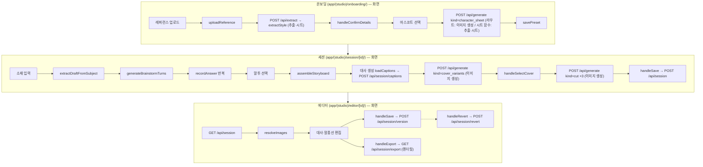

# 컷툰 코파일럿 파이프라인 — 온보딩 → 세션 → 에디터

<!-- 기준점 id는 변경 금지 -->

마지막 전체 대조: 2026-10-06 · `cf9feb7`. 그보다 오래된 절에만 절 기준을 남긴다.

머지된 코드만 기준으로 한다. 열려 있는 PR·이슈의 계획은 넣지 않는다. 함수명·파일명이 식별자다 — 라인 번호는 붙이지 않는다.

상태 표기의 뜻은 `docs/operations.md` 구현 현황표와 같다 — 완료(쓸 수 있음) · 부분(일부만 동작, 비고·관련 이슈 참고) · 미완.

5줄 요약: 온보딩(레퍼런스→스타일→마스코트→시트→저장) → 세션(소재→3턴→말투·대사→표지 3안→3컷→저장) → 에디터(수정·되돌리기→Export). 유료 호출은 시트 1 + 표지 3 + 컷 3. 저장은 세션 `POST /api/session`과 에디터 버전 저장 2곳. 대사는 Export 때만 그림에 굽는다.

**범위**: 화면(`app/(studio)/`), 스키마·LLM(`lib/llm/`, `spec/`, `app/api/brainstorm/`), 백엔드·저장(`lib/db/`, `app/api/preset/`, `app/api/session/`, `app/api/upload/`) 위주로 채웠다. 이미지 생성·추출 영역(`lib/openai/`, `app/api/generate/`, `app/api/extract/`)과 렌더링 영역(`lib/render/`)은 내부를 전부 적지 않고, 화면·백엔드 쪽이 그 경계를 어떻게 호출하는지(계약)까지만 적었다. 이미지 생성(5-1)·추출·시트(5-1b)·합성·Export(5-2) 절은 모두 작성됐다. 영역별 담당자는 `docs/operations.md` 소유권 표를 본다.

## 1. 전체 흐름


```mermaid
flowchart TD
  subgraph 온보딩["온보딩 (app/(studio)/onboarding/) — 화면"]
    U1[레퍼런스 업로드] --> A1[uploadReference]
    A1 --> A2["POST /api/extract → extractStyle (추출·시트)"]
    A2 --> A3[handleConfirmDetails]
    A3 --> A3m[마스코트 선택]
    A3m --> A4["POST /api/generate kind=character_sheet (라우트: 이미지 생성 / 시트 함수: 추출·시트)"]
    A4 --> A5[savePreset]
  end

  subgraph 세션["세션 (app/(studio)/session/[id]/) — 화면"]
    B1[소재 입력] --> B2[extractDraftFromSubject]
    B2 --> B3[generateBrainstormTurns]
    B3 --> B4[recordAnswer 반복]
    B4 --> B4t[말투 선택]
    B4t --> B5[assembleStoryboard]
    B5 --> B5c["대사 생성 loadCaptions → POST /api/session/captions"]
    B5c --> B6["POST /api/generate kind=cover_variants (이미지 생성)"]
    B6 --> B7[handleSelectCover]
    B7 --> B8["POST /api/generate kind=cut ×3 (이미지 생성)"]
    B8 --> B9[handleSave → POST /api/session]
  end

  subgraph 에디터["에디터 (app/(studio)/editor/[id]/) — 화면"]
    C1[GET /api/session] --> C2[resolveImages]
    C2 --> C3[대사·말풍선 편집]
    C3 --> C4[handleSave → POST /api/session/version]
    C4 -.-> C5[handleRevert → POST /api/session/revert]
    C3 --> C6["handleExport → GET /api/session/export (렌더링)"]
  end

  온보딩 --> 세션 --> 에디터
```

<a id="pipe-onboarding"></a>
## 2. 온보딩 (화면)

| 순서 | 함수 | 위치 | 호출 대상 |
|---|---|---|---|
| 1 | `handleFilesSelected` → `runAnalysis` | `OnboardingFlow.tsx` | `uploadReference`, `analyzeStyle` |
| 2 | `uploadReference` | `style-analysis.ts` | `POST /api/upload` → `uploadAsset`(`lib/asset-store.ts`) |
| 3 | `analyzeStyle` | `style-analysis.ts` | `POST /api/extract { assetUris }` — 추출·시트 경계, 3번 섹션 참고 |
| 4 | `handleConfirmStyle` → `handleConfirmDetails` | `OnboardingFlow.tsx` | 스타일 확인·재추출과 상세 입력 확인을 거친 뒤 마스코트 단계로 |
| 5 | `handleConfirmMascot` → `createProject` | `OnboardingFlow.tsx` | `POST /api/generate { kind:'character_sheet', preset }` — 라우트는 이미지 생성, 내부 `generateCharacterSheet`(`extract.ts`)는 추출·시트 영역. 이어서 `POST /api/preset` → `savePreset`(백엔드·저장) |
| 6 | 프로젝트 이름 변경 (#161) | — (화면 호출자 없음) | `PATCH /api/preset`(`app/api/preset/route.ts`) → `renameProject`(`lib/db/presets.ts`) |
| 7 | 프로젝트 비활성화 (#161) | — (화면 호출자 없음) | `DELETE /api/preset`(`app/api/preset/route.ts`) → `archiveProject`(`lib/db/presets.ts`). 하드 삭제가 아니라 `projects.archived_at` 소프트 삭제라 세션·컷 데이터는 남고 목록에서만 빠진다 |

<a id="pipe-session"></a>
## 3. 세션 (화면)

| 순서 | 함수 | 위치 | 호출 대상 |
|---|---|---|---|
| 1 | `startBrainstorm` → `loadTurns` | `SessionFlow.tsx` | `POST /api/brainstorm` |
| 2 | (route, 스키마·LLM) | `app/api/brainstorm/route.ts` | `body.draft` 없으면 `extractDraftFromSubject`(`brainstorm.ts`) 먼저 호출 |
| 3 | `generateBrainstormTurns` | `brainstorm.ts` | 내부 `isSlotFilled`·`areAllSlotsComplete`로 draft 기준 남은 턴만 생성. gpt-4o 텍스트 호출(스키마·LLM 소유) |
| 4 | 응답의 `resolved` | `SessionFlow.tsx` `loadTurns` | `setAnswers`로 선반영 (#154) |
| 5 | `recordAnswer` 반복 | `SessionFlow.tsx` | 3턴(또는 축소된 턴) 완료 시 말투(`tone`) 단계로 |
| 6 | `handleSelectTone` | `SessionFlow.tsx` | 말투 선택 → `assembling`으로 전이 |
| 7 | assembling effect | `SessionFlow.tsx` | `assembleStoryboard`(`storyboard-assembly.ts`) |
| 8 | `assembleStoryboard` 내부 | `storyboard-assembly.ts` | `buildSessionCast`(`session-cast.ts`, #150), `getBeatsForFlow`/`getFlowOptions`(`narrative-flow.ts`, #153) |
| 9 | 대사 생성(F2) | `loadCaptions`(`SessionFlow.tsx`) | `POST /api/session/captions` — tone 단계 선택값 + subject·flow·beats·cast·context를 보내 4컷 대사와 연출(F4)을 받고 `applyCaptions`·`applyDirections`로 조립 컷에 반영. 컷별 다시 뽑기 `regenCutCaption`은 같은 경로에 `cut_index`를 함께 보냄 |
| 10 | `loadCoverVariants` | `SessionFlow.tsx` | `POST /api/generate { kind:'cover_variants', storyboard, preset, referenceAssets }` — 이미지 생성 경계 |
| 11 | `handleSelectCover` | `SessionFlow.tsx` | `generateChainedCuts`(`generate-client.ts`, 화면) → `POST /api/generate { kind:'cut', ... }` × 3 — 이미지 생성 경계 |
| 12 | `handleSave` | `SessionFlow.tsx` | `POST /api/session` (백엔드·저장, `lib/db/sessions.ts`에 저장) + `selections` 동봉(#207 — 표지 표시 때 `recordRound`·선택 때 `markSelected`, 저장 때 `toPayload`, 기록 실패 시 `selectionsSaved:false` 토스트) |

### 대사 화자·말풍선 좌표 (#242)

대사 생성(`POST /api/session/captions`, `generateCutCaptions`)이 2인 컷 대사 항목에 화자 id(`speaker`)를 싣고, 화면(`SessionFlow.tsx` `applyCaptions`·`regenCutCaption`)이 `setCaptionSpeaker`로 `caption.speaker_index`(0|1, `characters_in_frame` 순번)로 바꿔 저장한다. 저장 검사(`storyboardContractProblems` SPK·ANC 규칙)가 1인 컷 키 금지·범위·좌표 형식을 보고, Export는 화자·좌표가 없어도 `position` 기본 위치로 그린다(관대 읽기). 인물 배열 순서·구성은 컷 다시 뽑기(그림 재생성)로만 바꾼다 — 저장된 순서가 그림 좌우와 같다는 보장은 이 변경에서 두지 않는다(공개 한계).

### 표지 선택 기록 저장 계약 (#207)

`selections` 테이블에 "보여 준 후보 묶음(라운드)" 단위로 쌓는다 — 한 행 = 화면에 보여준 후보 한 묶음. `variant_index`는 고른 위치(다시 뽑기로 버린 라운드면 null), `(session_id, cut_index, round)`은 유일하다. 화면이 모아 두었다가 `handleSave` → `POST /api/session`의 `selections`로 함께 보내면, `createSession` 성공 뒤에 `insertSelections`(`lib/db/selections.ts`)가 저장한다. 일시적 DB 오류에만 전체 예산 3초 안에서 재시도하고(시도별 최대 1초·백오프 200·400ms·남은 예산 300ms 미만이면 포기), 그래도 실패하면 세션 저장은 200 + `selectionsSaved: false`로 응답한다(사용자 작업 보존 우선). 화면 쪽 기록 헬퍼 4개는 `lib/session/selection-log.ts`다 — `createSelectionLog`, `recordRound`, `markRegenerated`, `markSelected`, 전송용으로 바꾸는 `toPayload`. 화면 연결(#213): 표지 표시 때마다 `recordRound`, 선택 때 `markSelected`, 저장 때 `toPayload`로 동봉하고, `selectionsSaved:false`면 실패 토스트(비차단). 읽는 쪽(프로젝트별 선호·프리셋 승격 규칙)은 이번에 만들지 않고, 나중에 `sessions.preset_id`로 묶어 읽는다(#202).

<a id="pipe-editor"></a>
## 4. 에디터 (화면)

| 순서 | 함수 | 위치 | 호출 대상 |
|---|---|---|---|
| 1 | mount effect | `EditorFlow.tsx` | `GET /api/session` → `resolveImages` |
| 2 | 대사·말풍선 편집 | `EditorFlow.tsx` | 로컬 state만, 호출 없음 |
| 3 | `handleSave` | `EditorFlow.tsx` | `POST /api/session/version` (백엔드·저장) |
| 4 | `handleRevert` | `EditorFlow.tsx` | `POST /api/session/revert` (백엔드·저장) |
| 5 | `handleExport` | `EditorFlow.tsx` | 미저장 수정이 있으면 `handleSave`를 먼저 호출하고 실패하면 내보내지 않는다(#264). `GET /api/session/export` — 렌더링 경계, 5-2번 참고 |
| 6 | 이탈 경고 | `EditorFlow.tsx`·`SessionFlow.tsx` | 미저장 결과·생성 중 새로고침·탭 닫기 시 브라우저 확인창(`beforeunload`, #259·#264) |

## 5. 이미지 생성·합성 파트

아래 세 절은 특정 화면 단계(온보딩·세션·에디터)의 하위가 아니다 — 이미지 생성(5-1)은 온보딩·세션 양쪽에서 쓰이고, 합성·Export(5-2)는 에디터에서 쓰인다. 5-1·5-1b·5-2 모두 작성됐다(B③ 반영, #156). 영역별 담당자는 `docs/operations.md` 소유권 표를 본다.

### 5-1. 텍스트/이미지 생성 (이미지 생성)

`app/api/generate/route.ts` · `lib/openai/generate.ts` · `lib/openai/provider.ts` 소유. `generate.ts` 가 내보내는 것은 아래 일곱 개다.

| export | 위치 | 용도 |
|---|---|---|
| `generateCut` | `generate.ts` | 컷 1장 생성 |
| `generateCoverVariants` | `generate.ts` | 표지 3안 생성 |
| `activeMascot` | `generate.ts` | 마스코트 참조 결정 (#150) |
| `buildCutPrompt` | `generate.ts` | 표지·컷 공통 프롬프트 조립 |
| `OUTPUT_SIZE` | `generate.ts` | `{width:1024,height:1024}`. `extract.ts` 가 시트 크기로 가져간다 |
| `promptHint` | `generate.ts` | `prompt_hints` 조회. 없으면 `undefined` — 힌트 유무를 구분해야 하는 자리를 위해 `hint()`와 나눠 뒀다 |
| `ratioClause` | `generate.ts` | `character_ratio` 절. **폴백 규칙까지** 한 곳에 둔다 — 아래 참고 |

`ratioClause(value)` 가 규칙 자체를 담는다. `extract.ts`(추출·시트)도 이것을 가져다 써서 시트와 컷이 항상 같은 비율 지시를 받는다.

```ts
const v = value ?? '2.5head'
return promptHint('character_ratio', v) ?? `${v} body proportions`
```

**순서가 중요하다: 기본값을 먼저 적용한 뒤 힌트를 찾는다.** 반대로 하면 `character_ratio` 가 비었을 때 힌트를 건너뛰고 토큰으로 떨어진다. 그리고 라벨(`body proportions`)은 **힌트가 없을 때만** 붙인다 — 힌트 서술문은 그 자체로 완결된 구라서 뒤에 라벨을 또 붙이면 문장이 깨진다.

`promptHint`만 공유하고 이 세 줄을 각 파일에 복사해 두면 규칙이 갈라진다 — 그래서 절 자체를 공유한다(경위 #126·#129, PR #128·#130). 스모크의 정적 검사가 `promptHint('character_ratio', …)` 가 **몇 곳에 나오는지** 세는 이유다.

`generateCharacterSheet` 는 이 파일이 아니라 `extract.ts`(추출·시트) 소유다 — `extractStyle` 과 결합도가 높아 #19 로 그렇게 정했다. `route.ts` 가 `kind:'character_sheet'` 를 그쪽으로 넘긴다.

**모델·API — 추출·시트 쪽과 다르다**

`client.responses.create`(`generate.ts`), 모델 `gpt-5`(`RESPONSES_MODEL`), 이미지는 내장 도구 `tools: [{ type:'image_generation', size:'1024x1024' }]`로 만든다. 응답에서 `image_generation_call` 출력을 찾아 base64 를 꺼낸다.

추출·시트 쪽의 `generateCharacterSheet` 는 `client.images.generate`(Images API)를 쓴다. **같은 이미지 모델을 부르는 두 경로가 공존한다** — 체이닝(`previous_response_id`)이 Responses API 에만 있어서 컷 쪽은 이 경로여야 한다. SDK(^7.5.0) 의 Responses 타입이 도구 옵션을 못 따라와 `as any` 로 우회하고 있다(`generate.ts`의 Responses 호출부 우회 주석).

**세션당 이미지 호출 횟수**

| 단계 | 호출 | 비고 |
|---|---|---|
| 표지 3안 | **3회** (병렬) | `Promise.allSettled` — 한 안이 실패해도 성공분을 버리지 않는다 (#104) |
| 나머지 3컷 | **3회** (순차) | 체이닝이라 병렬 불가 |
| **골든 패스 합계** | **6회** | 캐릭터 시트 1회는 온보딩 소관(5-1b) |

표지 3안에는 **부족분 재시도**가 있다(#108·#118). 상한은 `count * 2 = 6` 회이고, 한 배치가 통째로 실패하면 그 자리에서 멈춘다(`gained === 0`) — 남은 실패 원인이 업로드 계열, 즉 환경 문제라 재시도해도 같이 실패하기 때문이다(#67 이 그 상황이었다).

```bash
COVER_VARIANT_RETRY=off   # 재시도를 끈다. 기본값은 on
```

**판정·측정 때는 끄는 것을 권한다.** 재시도가 부족분을 채워버리면 "3안 중 2안" 이라는 수치가 보이지 않는다. 부족분이 생기면 원인이 세 갈래로 찍힌다 — `재시도 꺼짐` / `재시도 한도 소진` / `배치 전멸로 중단`.

**호출 시간 로그** — 이미지 호출마다 `[image] <kind> <설정> ok|fail <초>s [사유]` 한 줄을 남긴다(`timeImageCall`, `lib/openai/image-setting.ts`). kind는 `character_sheet`·`cover_variant`·`cut`·`style_extract`다. 설정 표기는 `settingTag`(`IMAGE_PROVIDER=<값>`, `style_extract`는 모델명)다. 실패 사유는 숫자 status와 허용 목록 코드·이름만 찍는다 — 키·URL·메시지는 기록하지 않는다. 표지 묶음 끝에는 `cover_variants done x/3 attempts=n` 요약을 남긴다(attempts는 SDK 자동 재시도 미포함, #274).

**호출 순서 (세션 1회, 재시도 없는 골든 패스)**

화면 영역 소유 파일은 **함수명만 적는다** — 5-1b 절과 같은 이유다.

| 순서 | 함수 | 위치 | 호출 대상 |
|---|---|---|---|
| 1 | `loadCoverVariants` | `SessionFlow.tsx` → `generateCoverVariants`(`generate-client.ts`) | `POST /api/generate {kind:"cover_variants"}` → **`generateCoverVariants`** ×1 (내부 3회) |
| 2 | `handleSelectCover` → `generateChainedCuts` | `generate-client.ts` | `POST /api/generate {kind:"cut"}` ×3 → **`generateCut`** ×3 |

`kind:'cover_variants'` 응답에는 `requested: 3` 이 함께 실린다(`route.ts`, #108). `allSettled` 라 배열이 1~3 개일 수 있어서, 화면이 `result.length < requested` 로 부족분을 판단한다(#117).

**프롬프트 조립 — `buildCutPrompt`**

표지 3안과 4컷이 **같은 함수**를 쓴다. 표지는 `cuts[0]`, 컷은 `nextUngeneratedCut`이 고른 컷을 넘긴다.

넣는 순서는 이렇다.

| # | 조각 | 근거 |
|---|---|---|
| 1 | 시트는 **그림체만** 따르고 인물은 아래 서술을 따른다 | 런타임 시트는 `preset.context`(타깃 독자)로 그려진 제3의 인물이라 컷 인물과 대응하지 않는다 (#113) |
| 2 | `Style:` — `line_weight` · `saturation` · `background_density` · `ratioClause` | `character_ratio` 가 문장 끝이다. 힌트 서술문이 길어서 뒤에 절이 붙으면 배경 지시가 묻힌다 (#131) |
| 3 | `Color palette:` · `Style keywords:` | 값이 없으면 문장을 넣지 않는다 — 채움말이 지시로 읽힌다 |
| 4 | 소재 + **설명 장치 금지** | 차트·그래프·화살표·아이콘·라벨·해부 도해 금지, 숫자는 캡션 레이어 몫 (#146). 효과선은 허용 (#133 결정 6) |
| 5 | 타깃 독자 (`Who this comic is made for — not who appears in the panel`) | 타깃과 등장 인물이 다를 수 있다 |
| 6 | `narrative_beat` · `shot_type` · `camera_angle` · `time_of_day` | 전부 `hint()` 경유 — enum 토큰을 그대로 넣으면 모델이 못 알아듣는다 |
| 7 | `Character:` — `cast[].description` + 표정·포즈 | 서술을 앞세운다. 없으면 나이·성별이 컷마다 바뀐다. 체이닝 컷은 앞 컷과 같게 명시해 머리색·헤어스타일·얼굴·나이·복장을 유지한다(#258, 표지·첫 컷 제외) |
| 8 | `reserved_zone` 지시 | 프레임 **안**을 비운다 — 흰 띠를 붙이는 것이 아니다 |
| 9 | `rules.forbidden` → `Do not include:` | 사용자가 적은 금지 요소 |
| 10 | 말풍선·글자 억제 | P0 게이트 2 |

**2인 컷 좌우 배치** — `buildCutPrompt`는 `characters_in_frame`이 **정확히 2명**일 때만 인물 문장 머리를 `Character on the left/right side of the panel:`로 바꾼다([0] 왼쪽, [1] 오른쪽). `speaker_index`는 읽지 않고 조립 순서만 쓴다 — 순서는 `storyboard-assembly.ts` 한 곳에서 정해지고(주인공이 [0]) 이후 바뀌지 않는다. 1명·0명·3명 이상은 그대로 둔다. 표지 3안도 같은 함수를 타므로 첫 컷이 2인이면 표지에도 들어간다(#285, 유료 3장 3/3 확인).

4번 소재 문장과 7번 `cast[].description`은 `projectForModel(text, subject, subject_tags)`로 투영해 넣는다 — 소재의 `[브랜드]` 원문 대신 category가 들어가고, `subject_tags`가 없거나 형태가 어긋나면 "제품"이다. 대괄호가 없는 소재는 그대로다(#206·#237). 캐릭터 시트는 소재를 받지 않아 해당되지 않는다.

`spec/vocabulary.json` 의 `prompt_hints` 를 쓰는 자리가 2·5·6·7번이다. 힌트가 없는 값은 토큰이 그대로 나가므로, 새 enum 값이 생기면 힌트도 같이 넣어야 한다 — `npm run spec:sync-check` 가 커버리지를 검사한다.

빈 힌트 배열(`[]`)은 원본으로 폴백하지 않는다 — `keyword_hints ?? keywords`라서 빈 배열이면 컷은 해당 문장이 생략되고, 캐릭터 시트는 `default comic style`이 들어간다(#234).

**`spec/vocabulary.json` 소비 방식 (컷 프롬프트)**

`generate.ts` 가 모듈 로드 때 한 번 import 한다 — 요청마다 파일을 다시 읽지 않는다. 조회는 `prompt_hints` 만 쓰고, 최상위 enum 값 목록(`expression` 등)은 읽지 않는다. 표의 "조각"은 위 `buildCutPrompt` 표의 번호다.

| 카테고리 | 조회 경로 | 조각 | 들어가는 문장 | 힌트가 없을 때 |
|---|---|---|---|---|
| `character_ratio` | `ratioClause` → `promptHint` | 2 | `Style:` 끝 | 기본값 `2.5head` 를 먼저 적용한 뒤 `` `${값} body proportions` `` |
| `life_stage` | `HINTS.life_stage` 직접 조회 (`buildCutPrompt` 안) | 5 | `Who this comic is made for …` | 밑줄을 공백으로 (`job_seeker` → `job seeker`) |
| `narrative_beat` | `hint()` | 6 | `This panel's role in the story:` | 토큰 그대로 |
| `shot_type` | `hint()` | 6 | `Framing:` | 토큰 그대로 |
| `camera_angle` | `hint()` | 6 | `Camera:` | 토큰 그대로 |
| `time_of_day` | `hint()` | 6 | `Lighting:` | 토큰 그대로 |
| `expression` · `pose` | `hint()` | 7 | `Character:` 의 `cast[].description` 뒤 | 토큰 그대로 |

**컷 프롬프트가 `vocabulary.json` 을 거치지 않는 값**

- `reserved_zone` — enum 값은 `vocabulary.json` 에 있지만 문장은 `reservedZoneHint`의 고정 영어 문장이다. `prompt_hints` 에 항목이 없다.
- `bubble_type` · `position` — 컷 프롬프트에 넣지 않는다. 말풍선은 합성 단계(5-2절) 몫이다.
- `style.line_weight` · `saturation` · `background_density` — 토큰을 그대로 넣는다(`medium line weight` 식).
- `context.industry` · `age_band` · `style.palette` · `keywords` · `rules.forbidden` — 사용자 입력 문자열을 그대로 잇는다.

2026-09-30 기준(`vocabulary_version: "1.0"`) 위 표의 8개 카테고리는 `npm run spec:sync-check` 에서 전부 커버리지가 채워져 있다 — "힌트가 없을 때" 열은 새 값이 추가됐는데 힌트를 안 넣었을 때의 동작이다.

**reference 주입 (캐릭터 동일성 방어선)**

`referenceUris`(`generate.ts`)가 호출부의 `referenceAssets` 에 `preset.assets.character_sheet` 를 합친다 — 호출부가 빼먹어도 시트가 들어간다. `toInputImages`(`generate.ts`)가 `readAsset` 으로 읽고, **못 읽은 것은 로그에 남기고**, 결과가 0장이면 **유료 호출 전에 던진다.** 시트 없이 만든 이미지는 P0 게이트를 통과할 수 없어 생성비만 버리는 것이기 때문이다.

`style_refs` 는 일부러 넣지 않는다 — reference 이미지를 늘리면 시트의 비중이 묽어진다. 스타일은 프롬프트의 `Style:` 문장이 담당한다.

**체이닝**

`GeneratedImageResult.continuationToken` ↔ `previous_response_id`. PRD 6절이 프로바이더 중립을 요구해서 `chatSession`·`previous_response_id` 를 계약에 노출하지 않는다.

**표지 3안은 체이닝하지 않는다** — 세션에 누적하면 2안이 1안에 끌려가 서로 닮는다. `generateCoverVariants` 시그니처가 `continueFrom` 을 받지 않는 것으로 그 독립성을 타입에 드러낸다(#50).

"몇 번째 컷인지" 를 별도 파라미터로 받지 않는다. 호출부가 `storyboard.cuts[].generated_image` 를 채워 다시 넘기면 `nextUngeneratedCut` 이 다음 컷을 고른다 — 그래서 리졸브가 실패해도 **raw `asset` 으로 그 필드를 채우면** 체이닝이 끊기지 않는다(#104, PR #135). 같은 필드가 세션 목록의 완료 판정 근거이기도 하다(#136·#137).

**출력 크기**

`resizeToOutput`(`generate.ts`)이 `sharp` 로 `OUTPUT_SIZE` 를 강제한다. 모델이 요청한 `size` 와 다른 크기를 낼 때가 있고(실측 `1536x1024` · `1199x1312`), 그러면 계약 ④ 의 `width`/`height` 가 실제 픽셀과 어긋난다. 리사이즈가 실패하면 원본을 살리고 `sharp.metadata()` 로 실제 크기를 다시 읽어 반환한다 — 유료 결과를 버리지 않는다(#104).

`fit:'cover'` 의 crop position 은 `reserved_zone` 과 같은 쪽이다(`top`이면 위를 남기고 아래를 자름, `bottom`이면 반대) — `resizeToOutput`(`generate.ts`)이 `reservedZone ?? 'centre'` 로 넘긴다. `reserved_zone` 이 없으면 기본값(`centre`)이다. 실측(위쪽 200px 여백, `1199x1312` → `1024x1024`): `centre` 122px 남음, 같은 쪽 171px, 반대쪽 74px (#105, PR #166).

**1024×1024 인 이유**

정사각형은 산출물이 인스타툰이기 때문이다 — 인스타그램이 완전히 지원하는 비율 범위 안이고, 4컷을 같은 틀로 이어 붙일 수 있다. 1024 는 인스타툰 요구와 모델 제약이 겹치는 유일한 값이다: 인스타그램은 320~1080px 원본을 보존하고, `gpt-image-1` 의 고정 3종에 1080 이 없고, `gpt-image-2` 는 양변이 16의 배수여야 해서 `1080/16 = 67.5` 가 실패한다. 처음 1080 으로 넣었다가 이 근거로 정정했다(#63).

**검증**

`app/api/generate/_smoke-test.mjs` — 표준 라이브러리만 쓰고 테스트 러너를 추가하지 않는다. 정적 배선 검사 4건은 **서버도 크레딧도 필요 없다.** 실제 생성 경로는 유료라 `RUN_REAL_GENERATION=1` 게이트 뒤에 있고, 읽을 수 있는 시트 URI 를 `SMOKE_SHEET_ASSET` 으로 받아야 돈다.

정적 검사가 지키는 항목은 — `continueFrom` 배선 누락(#75), `Promise.all` 복귀(#104), reference 0장 미차단(#67), 시트·컷 스타일 필드 불일치(#126·#129). 각 항목의 경위는 링크된 이슈·PR을 본다.

프롬프트 문구 품질은 정적 검사로 잡히지 않는다. **codex 환경에서 같은 프롬프트를 4회씩 돌려 육안 판정**하는 방식으로 검증했고, 결과는 #121 · #146 · #113 에 기록돼 있다.

**데모 캐시 만들기 도구** — `scripts/demo-cache-build.ts --session <id>`: 세션·`selections`·이미지를 읽기만 해서 `public/demo-cache/`에 PNG 6장(표지 3안 + 컷 2·3·4) + `manifest.json`을 쓴다. 이미지를 만들지 않는다(생성 호출 0). 점검(소재 #240 고정값·컷 4장·전 컷 1인·표지 후보 3안 및 선택 일치·1024×1024 PNG)이 하나라도 어긋나면 파일을 하나도 쓰지 않고 종료 코드 1로 끝난다. 표지 3안은 `selections`의 `candidate_assets`에서 읽으므로 **선택 기록이 없으면 만들 수 없다**(#286).

### 5-1b. 스타일 분석 · 캐릭터 시트 생성 (추출·시트)

`lib/openai/extract.ts` 소유. 이 파일이 내보내는 건 아래 세 함수다.

- **`extractStyle(refs: Buffer[])`** — 모델 `gpt-4o`, `client.chat.completions.create` 1회, `response_format: json_object`, `max_tokens: 300`. `refs` N장을 **한 번의 호출**에 `image_url` content part N개로 담아 보낸다 — 이미지 장수와 API 호출 수는 무관하다. 반환 직후 비공개 헬퍼 `normalizeStyle()`(export 없음)이 필드 존재·enum 값을 검증·보정한다(#140) — 모듈 밖에서는 재사용할 수 없다.
- **`buildCharacterPrompt(preset: PresetInput)`** — 시트 프롬프트 조립. 시트와 컷이 같은 스타일 지시를 받도록 export한다(#126·#129 회귀 방지).
- **`generateCharacterSheet(preset: PresetInput)`** — 모델 `gpt-image-1`, `client.images.generate` 1회, `n: 1`, `size: "1024x1024"`(`OUTPUT_SIZE`). 내부에서 `buildCharacterPrompt(preset)`를 1회 호출해 프롬프트를 조립한 뒤 그 문자열로 이미지 1장을 만든다.

**호출 순서 (온보딩 1회, 재시도 없는 골든 패스)**

화면 영역 소유 파일(`OnboardingFlow.tsx`·`style-analysis.ts`)은 **함수명만 적는다** — 라인 번호를 붙이면 그 파일이 바뀔 때마다 이 표가 조용히 틀린다. 실측으로 겪었다: 이 표의 초판이 머지 당일 `OnboardingFlow.tsx` 라인 5개가 전부 어긋났다.

| 순서 | 함수 | 위치 | 호출 대상 |
|---|---|---|---|
| 1 | `handleFilesSelected` → `runAnalysis` | `OnboardingFlow.tsx` | — |
| 2 | `analyzeStyle` → `uploadReference` ×N | `style-analysis.ts` | `POST /api/upload` ×N |
| 3 | `analyzeStyle` → `fetch("/api/extract")` | `style-analysis.ts` | `POST /api/extract` → **`extractStyle`** ×1 |
| 4 | `handleConfirmDetails` → `handleConfirmMascot` | `OnboardingFlow.tsx` | 마스코트 단계로 (화면 전환, 호출 없음) |
| 5 | `createProject` → `fetch("/api/generate")` | `OnboardingFlow.tsx` | `POST /api/generate {kind:"character_sheet"}` → **`generateCharacterSheet`** ×1 |

**세션당 호출 횟수**

- 이미지 생성(유료) 호출: `generateCharacterSheet`는 프로젝트 생성 시 **정확히 1회**뿐이다 — 재시도 버튼이 없다(#19 결정: 세션마다 다시 만들지 않음). 그 프로젝트로 세션을 몇 개 만들거나 몇 번 재방문해도 추가 호출은 없다.
- 텍스트 호출: `extractStyle`은 `ResultStep`(`OnboardingFlow.tsx`)의 "다시 뽑기"를 누를 때마다 추가로 1회씩 늘어난다 — 상한이 없어 사용자가 원하는 만큼 반복 가능하다. 같은 클릭이 같은 파일을 `/api/upload`에 재업로드하므로, 재시도 1회당 업로드 N회 + 추출 1회가 함께 늘어난다.
- 참고: `generateCoverVariants`(이미지 생성)에도 별도 "다시 뽑기"가 있다(`SessionFlow.tsx`). 이건 `extract.ts` 소관이 아니라 혼동 방지로만 적는다.

**`spec/vocabulary.json` 소비 방식**

`extract.ts`는 `vocabulary.json`을 직접 import하지 않는다. `./generate`에서 `OUTPUT_SIZE`·`activeMascot`·`ratioClause` 세 개를 가져와 쓴다. `ratioClause(value)`는 내부에서 `promptHint('character_ratio', value)`로 `vocabulary.json`의 `prompt_hints.character_ratio` 항목을 찾고, 없으면 `` `${value} body proportions` `` 문자열로 폴백한다. `buildCharacterPrompt`가 이 결과를 시트 프롬프트에 그대로 넣는다 — `generate.ts`의 `buildCutPrompt`도 같은 헬퍼를 쓰기 때문에 시트와 컷이 항상 같은 비율 지시를 받는다(#126·#129 회귀 방지, PR #130).

### 5-2. 텍스트 레이어 합성·Export (렌더링 — B③)

아래는 B③ 담당분이 #156에 남긴 내용이다(기준: `main` f8aad0f). 함수명이 식별자다 — 라인 번호는 붙이지 않는다.

**호출 순서**

| 순서 | 함수 | 위치 | 하는 일 |
|---|---|---|---|
| 1 | `GET /api/session/export?id=` | `app/api/session/export/route.ts` | 세션 조회 → `toRenderCuts`로 `storyboard.cuts`를 `lib/render/`의 `Cut[]`로 좁힘(enum 밖 값은 `malformed`로 제외) |
| 2 | `exportCuts(cuts)` | `lib/render/export.ts` | `cut_index` 순 정렬 → 컷마다 `readAsset(generated_image)` → `composeCut` → ZIP. 이미지 없는 컷은 건너뛰고 `skipped`에 남김 |
| 3 | `composeCut(image, [caption], headTargets?)` | `lib/render/compose.ts` | 원본 이미지 위에 SVG 말풍선 오버레이를 sharp로 합성해 PNG 반환 |
| 4 | `buildZip(entries)` | `lib/render/zip.ts` | archiver `ZipArchive`로 `cut_<n>.png`들을 묶음 |

응답: `application/zip`, 헤더 `X-Export-Included` / `X-Export-Skipped`. 포함 컷이 0개면 빈 ZIP 대신 `409`.

**합성 방식 (`compose.ts`)**

- 대사는 **Export 시점에만** 이미지에 굽는다. 에디터 화면의 말풍선은 HTML 레이어라 합성과 별개다(PRD "텍스트 레이어" 원칙).
- 자리: `caption.position` 5종을 `POSITION_BOX`(`lib/render/position-box.ts` — 에디터 미리보기도 쓸 수 있게 분리, #278)의 고정 비율 박스로 바꾼다. 구석 자리는 일부러 캔버스 경계를 살짝 넘는다(웹툰식 "반 걸침").
- 크기: 박스 폭 안에서 글자 수에 맞춰 폰트 40→22px로 줄이며 줄바꿈(`fitText`), 높이 상한은 캔버스의 30%(`captionSvg`의 `fitText` 호출부 `maxHeight`).
- 모양: `rounded`는 텍스트 박스보다 가로 1.12배·세로 1.28배 타원(`ellipseRadii`), `rect`·`cloud`는 사각형 기반. 몸통과 꼬리는 **하나의 폴리곤**으로 그린다(겹쳐 그리면 이음매가 보임). 불투명도 0.98.
- 위 경계 보정: `rounded` 타원이 캔버스 위로 넘치면 넘친 만큼 아래로 민다(`captionSvg`의 rounded 윗넘침 보정).
- 아래 경계 보정: `bottom_*` 칸에만, 도형이 캔버스 아래로 넘치면 넘친 만큼 위로 올린다(몸통·글씨 같은 y, #276). `top`·`center`에는 걸지 않는다.
- 좌우 경계 보정: 구석 자리 도형은 줄이 `OVERHANG_MAX_LINES`(3줄) 이하일 때만 살짝 걸치고, 그보다 많으면 도형 전체를 캔버스 안으로 당긴다. 글자는 늘 캔버스 안쪽 `TEXT_SAFE_MARGIN` 안에 둔다(#169).
- 꼬리: 목표점(`HeadTarget`) 방향으로, 몸통 경계~목표점 거리의 40%, 최대 캔버스 높이의 12%(`resolveTail`의 `TAIL_REACH_RATIO`·`MAX_PROTRUDE_RATIO`, PR #163). `center` 자리도 목표점이 몸통 밖이면 그쪽으로 꼬리를 내고(길이 하한 = 고정 꼬리 길이), 목표점이 몸통 안이면 고정 방향·고정 길이의 짧은 꼬리로 폴백한다(`resolveTail`, `centerTail`, #192·#199). 기본 목표점은 늘 center 몸통 안이라 center는 고정 꼬리 폴백 그대로다. Export는 컷별 목표점 1개를 넘기는데 2인 컷 화자도 wide도 아니면 `undefined`라 기본 목표점을 쓴다(`headTargetForCut`, #273·#242).
- 목표점: `composeCut(image, [caption], headTargets?)`은 컷별 목표점을 받는다. Export(`exportCuts`)는 컷마다 1개씩 넘긴다(`headTargetForCut`) — 2인 컷에 `caption.speaker_index`가 0/1이면 가로 30%/70%(그림의 [0] 왼쪽·[1] 오른쪽, #285)에 세로는 shot_type 보정 그대로, 그 밖에는 wide 컷 가로 50%·세로 55%, 나머지 기본값(가로 50%·세로 42%, `DEFAULT_HEAD_TARGET`)이다(#273·#242). 1인 컷·0/1 밖 값은 무시한다. center 칸은 화자 목표점이 몸통 안이면 고정 꼬리로 폴백하고, `caption.anchor`는 아직 읽지 않는다. 1인 컷에서 인물이 한쪽에 있으면 꼬리가 빈 곳을 가리킬 수 있다(9/30 골든패스 컷 3·4에서 관찰).

**ZIP 구성**: 컷당 PNG 1장, 파일명 `cut_<cut_index>.png`. 파일명(ZIP 이름)은 `Content-Disposition`에서 subject 기반(한글은 `filename*`).

**쓰지 않는 값 (현재)**: `reserved_zone`은 `compose.ts`가 읽지 않는다(크롭에서만 씀, #105/PR #166). `bubble_type`·`position`은 컷 프롬프트에 안 들어가고 여기서만 쓴다.

**알려진 한계**

- 폰트가 `Malgun Gothic`/`Apple SD Gothic Neo` 시스템 폰트에 의존한다(`compose.ts`의 `FONT_FAMILY`). 한글 폰트가 없는 리눅스 서버에 배포하면 글자가 깨질 수 있어, 배포 전 폰트 포함이 필요하다.
- 글자 폭은 실제 폰트 측정이 아니라 추정치(한글 = 폰트 크기, 영문·숫자 = 0.55배)다.
- 아주 긴 대사 경계·`center` 덮음은 #192로 해결. `center` 꼬리 방향(화자 쪽)은 #199 후속.

**프로젝트 폰트 (#209)** — 확인 API(`POST /api/preset/font/validate` → `validateFontUrl`(`lib/llm/font-probe.ts`))와 Export(`loadFont`(`lib/render/font.ts`))는 같은 공용 함수 `resolveFontSource`로 폰트를 고르고 읽는다. 정책은 호출하는 층이 정하고(둘 다 `httpsOnly`), 성공 응답의 `url`은 입력값 trim 그대로 둔다. 성공 보장은 검증 시점 기준이다 — 등록 뒤 원격 응답이 바뀌면 Export는 `loadFont`의 시스템 폰트 폴백으로 그린다.

## 6. 데이터 파일 vs 코드 (화면·스키마·LLM·백엔드 영역분)

**`spec/data/`로 이미 분리된 것**

| 파일 | 내용 | 로더 |
|---|---|---|
| `cta_presets.json` | CTA 문구 8종 | `lib/llm/cta-presets.ts` |
| `narrative-flow.json` | 서사 흐름 템플릿 3종(#153) + `no_cta_beats`(#205) | `lib/llm/narrative-flow.ts` |
| `style-vocabulary.json` | 스타일 키워드 매핑 | `lib/llm/preset-guard.ts`(`checkUnmappedWordsPolicy` 관련) |
| `caption-tones.json` | 컷 대사 톤 목록·설명 | `lib/llm/caption-tones.ts` |

**`spec/vocabulary.json`**(위 `data/`와 다른 위치, 스키마·LLM 영역) — enum별 프롬프트 힌트. 이미지 생성 영역(`lib/openai/generate.ts`)이 프롬프트 조립에 쓴다. **캐릭터 시트 쪽 소비 경로는 5-1b절에 적었다**(`extract.ts` → `ratioClause` → `promptHint`). 컷 프롬프트(`buildCutPrompt`)의 소비 방식은 5-1절에 적었다.

**컷 기본값 — `spec/data/cut-defaults.json` + `lib/llm/cut-defaults.ts`로 분리됨** (#152, 화면·스키마·LLM 영역)

| 값 | 위치 | 내용 |
|---|---|---|
| `beat_expression_pose` | `cut-defaults.json` | narrative_beat별 표정·포즈 매핑 |
| `beat_caption_templates` | `cut-defaults.json` | narrative_beat별 캡션 문구 템플릿 |
| `cut_shot_plan` | `cut-defaults.json` | 컷별 shot_type·camera_angle 고정 시퀀스 |
| `caption_positions` | `cut-defaults.json` | 컷별 캡션 위치 고정 시퀀스 |
| `cta_fallback` | `cut-defaults.json` | cta beat 폴백 대사 강도별(soft·clear, #205) |

조연 기본값·등장 컷(`supporting_default`, `supporting_cut_index`)과 1컷 time_of_day(`first_cut_time_of_day`)도 같은 파일에 있다. `storyboard-assembly.ts`(조립)와 `captions.ts`(폴백)가 로더(`cut-defaults.ts`)로 같은 값을 읽는다.

## 7. 소유 경계

폴더·파일별 담당자는 `docs/operations.md` 소유권 표를 본다(2차 소유권 개편 반영). 이 문서의 영역 이름(화면 / 스키마·LLM / 백엔드·저장 / 이미지 생성 / 추출·시트 / 렌더링)은 그 표의 담당 구분과 같은 뜻이다.

## 8. 호출자가 하나뿐이거나 데모 전용인 함수 (전부 스키마·LLM 영역)

| 함수 | 위치 | 실제 호출자 | 관련 이슈 |
|---|---|---|---|
| `buildSessionCast` | `lib/llm/session-cast.ts` | `assembleStoryboard`(`storyboard-assembly.ts`) | #150 |
| `mergeStyleValues` | `lib/llm/style-merge.ts` | `resolvePresetStyle`(`style-resolve.ts`) 경유 온보딩 | #151 |
| `checkUnmappedWordsPolicy` | `lib/llm/preset-guard.ts` | `resolvePresetStyle`(`style-resolve.ts`) 경유 온보딩 + `preset-guard.demo.ts`(데모 스크립트) | #125 |

`lib/llm/`의 나머지 export는 위 세 개를 제외하고 전부 실제 호출자가 있다(`DetailsStep.tsx`, `EditorFlow.tsx`, `SessionFlow.tsx`, `app/api/session/*`, `app/api/brainstorm/route.ts` 등에서 확인).
